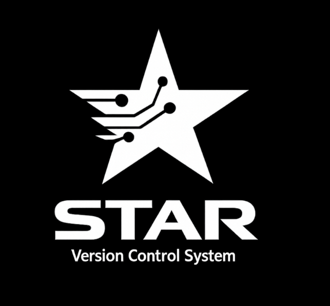

<div align="center">
  

  # Star ⭐
</div>

A simpler git-like version control system. Integrated with git, for uploading and pushing to your remote repos.

The `star` project is focused on making git more available and easy-to-use for new people in programming industry.

I have suffered too, so I had the vision to make it easier for myself and for other people.

---

## Features

- **`init`**: Initialize the `.star` repository structure.
- **`login`**: Configure author name and email identity (`star login "Name" "email"`).
- **`remote`**: Show or configure remote repository URL (`star remote <url>`). Supports HTTPS & SSH.
- **`add`**: Stage a specific file or all files (`star add .` / `star add -A`). Respects `.starignore`.
- **`commit`**: Record staged changes into a new commit (`star commit "msg"` or `star commit -m "msg"`).
- **`push`**: Push commit history to remote repository (`star push` or `star push --force`).
- **`pull`**: Pull remote changes from GitHub and sync into local index (`star pull`).
- **`diff`**: View line-by-line colored diff of modified files (`star diff`).
- **`log`**: Display commit history (`star log` or `star log -n <limit>`).
- **`status`**: Show branch status with staged, modified, and untracked files.
- **`branch`**: Create a new branch, list branches (`star branch`), or delete a branch (`star branch -d <name>`).
- **`checkout`**: Switch branch/commit (`star checkout <name>`) or create and switch in one step (`star checkout -b <name>`).
- **`update`**: Check GitHub for the latest release and auto-update Star executable.
- **`version`**: Display current Star version.
- **`help`**: Print available commands and usage instructions.

---

## Build & Installation

To build the project from source, ensure you have [Go](https://go.dev/) installed on your system.

1. Clone or navigate to the root directory of the repository.
2. Compile the binary using the Go compiler (or run `.\build.ps1`):

```bash
go build -o star ./cmd/star
```

To run unit tests across all packages:

```bash
go test ./...
```

For Windows users, you can also use the graphical installer (`star-setup.exe`) which configures `PATH` automatically.

---

## Usage

```bash
# 1. Initialize an empty star repository in your current directory
star init

# 2. Configure author name and email identity
star login "Your Name" "your.email@example.com"

# 3. Configure remote repository URL
star remote https://github.com/username/repository.git

# 4. Stage a file or stage all files in current directory recursively
star add .

# 5. Commit your staged changes with a descriptive message
star commit -m "Initial commit"

# 6. Push commit history to GitHub
star push

# 7. Pull remote changes if remote contains new commits
star pull

# 8. View line-by-line diffs of modified files
star diff

# 9. View your commit history
star log -n 5

# 10. Check branch and working tree status
star status

# 11. Create and switch to a new branch in one step
star checkout -b feature-auth
```

---

## Project Structure

```text
star/
├── cmd/
│   └── star/             # Main CLI entrypoint & error parser
├── internal/
│   └── star/             # Core VCS domain engine, diff, push/pull & unit tests
├── installer/            # Inno Setup Windows installer script & logo assets
└── build.ps1             # Windows, Linux, & macOS cross-compilation script
```
